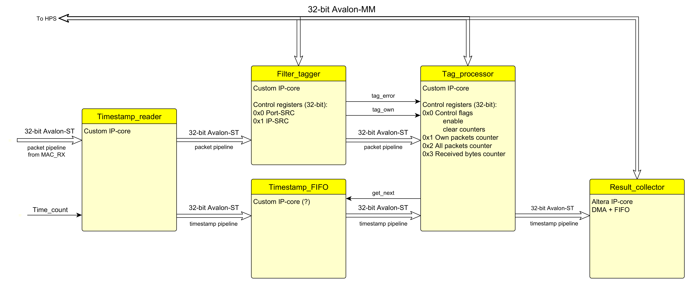

Высокоуровневая схема со встречи не потребовала изменений, поэтому особых в ней сомнений не осталось =)
Пара дополнительных моментов:
* Вроде все использованные альтеровские модули имеют обёртку для qsys-а. Тогда есть смысл все три моих макро-модуля сделать совместимыми, и в нём-же и собрать. Фактически получилась архитектура для top-level, которой будет достаточно =)
* Альтеровский MAC поддерживает управление регистрами PHY, посмотрел документацию на KSZ9021, который заявлен в плате DE10 - для работы системы доступ в них не должен понадобиться, но при необходимости можно подключить интерфейс управления к нему и настраивать по общей для системы шине Avalon-MM. (На перерисованном мной варианте интерфейс управления подключен, но пока про него можно забыть)

Теперь помодульно: (все регистры RW, если не указано обратное)

MAC
===
Используется готовое IP-ядро Altera Triple-sppeed-Ethernet в следующей конфигурации:
* Базовая конфигурация - 8-битная шина данных без включения встроенных FIFO.
* Включена фильтрация по MAC адресу интерфейса устройства (не свои пакеты не принимаются)
* Преамбула и CRC пакета обрезаются
* Интерфейс к PHY (MDIO) выключен

FIFO-шки решил выключить потому, что принимать пакеты нужно сразу, а сигнала окончания фрейма у MAC всё равно нет.
После этого остался один вариант ширины интерфейса данных - 8 бит.

Генератор (Timestamp_counter)
=============================
Модуль представляет из себя неуправляемый счётчик с заданным при сборке проекта делителем тактовой частоты, регистров статуса и управления нет. Результат выдаётся на 32-битный параллельный интерфейс Avalon conduit.

Передатчик
==========

Передатчик выполнен одним модулем. Имеет выходной интерфейс 32-bit Avalon-ST, для подключения на вход MAC.
Также модуль имеет контрольно-статусные регистры, подключенные на интерфейс 32-bit Avalon-MM и вход для данных с генератора timestamp (32-bit Avalon conduit).

Передатчик последовательно выдаёт пакет, состоящий из заголовка, заданного в блоке памяти по адресу 0x10-0x17, полученного перед отправкой пакета timestamp-а и заполнителя (0x00) до конца длины пакета.
После передачи пакета модуль ждёт заданное в регистре GAP количество тактов и начинает генерировать следующий пакет для создания определённого битрейта.
После передачи заданного в регистре Count количества пакетов модуль прекращает генерировать пакеты. Также передачу пакетов можно остановить флагами stop и reset.

Timestamp вставляется в пакет сразу после UDP-заголовка и занимает 4 байта.

Параметры:
* 0x0  Флаги разрешения передачи, остановки передачи, сброса(32-битный регистр)
* 0x1  Длина пакета (32-битный регистр)
* 0x2  Пауза между пакетам в тактах (32-битный регистр)
* 0x3  Число отправляемых пакетов (32-битный регистр)
* 0x10 - 0x17  Заголовок пакета pkt_header (область памяти длиной 28 байт, доступная через Avalon-MM)

Приёмник
========

Приёмник разбит на 5 подмодулей, данные пакетов передаются между ними по интерфейсу 32-bit Avalon-ST. После анализа нужных системе данных все полученные пакеты уничтожаются.
В текущем варианте системы все модули в цепочке обработки пакетов должны быть готовы принимать данные каждый такт и не останавливать приём данных от MAC. Если такой режим работы невозможен, нужно добавить FIFO на выходе модуля Timestamp_reader

Подмодуль Timestamp_reader
--------------------------
Помимо входного и выходного интерфейсов для передачи пакетов, модуль имеет вход для данных с генератора timestamp (32-bit Avalon conduit) и выход для результата измерения задержки (32-bit Avalon-ST)

Как только появляются данные в буфере MAC_RX читает пакет и флаг error, после чего передаёт полученные данные на выход.
В процессе обработки пакета вычисляет время между его отправкой и текущим временем системы, даже если это левый пакет. Полученная разность timestamp-а и системного времени передаётся в FIFO в виде транзакции по интерфейсу Avalon-ST сразу после того, как она будет посчитана.

Подмодуль Filter_tagger
-----------------------

Принимает пакет, проверяет наличие протокола UDP и значения порта назначения, а также IP-адрес назначения пакета. При совпадении всех требований пакет считается принятым для измерения задержки. Результат проверки передаётся в виде флага tag_own на выход в конце пакета.
Также модуль контролирует индикацию ошибки в MAC, статус ошибки тоже передаётся в конце пакета флагом tag_err.
На выход передаёт поток данных пакета и два сигнала-результата проверки (на пакет для измерения задержки и наличие ошибки), значения которых валидны в момент окончания пакета.
Параметры:
* 0x0  Port-SRC - порт протокола UDP (32-битный регистр, доступный через Avalon-MM)
* 0x1  IP-SRC - IP адрес хоста (32-битный регистр, доступный через Avalon-MM)

Подмодуль Timestamp_reader
--------------------

Принимает пакет, флаги от предыдущего модуля и результат измерения задержки из FIFO.

В конце каждого пакета проверяет флаг состояния, результаты, переданные модулем Filter_Tagger на то, что пакет принят без ошибок и предназначен для измерения задержки. Также, для каждого пакета модуль считывает значение timestamp_result из FIFO (в момент окончания пакета).

Если пакет проходит все проверки, можно считать результат измерения времени между отправкой и приёмом пакета достоверным и передать его на выход. В таком случае, модуль выдаёт результат в виде транзакции на интерфейсе Avalon-ST к модулю-приёмнику результатов. Остальные результаты игнорируются, но вычитываются для каждого пакета чтобы сохранить синхронизацию в FIFO.

Параметры:
* 0x0  Флаги включения модуля и сброса счётчиков статистики (32-битный регистр, доступный через Avalon-MM)
* 0x1  Счётчик полученных пакетов, для которых получилось измерить задержку
* 0x2  Счётчик всех полученных пакетов
* 0x3  Счётчик всех полученных байт.

Подмодуль Result_Collector
--------------------------

Принимает транзакции от предыдущего модуля и складывает их в 32-битный FIFO.

Предполагается использовать IP-ядро для DMA.